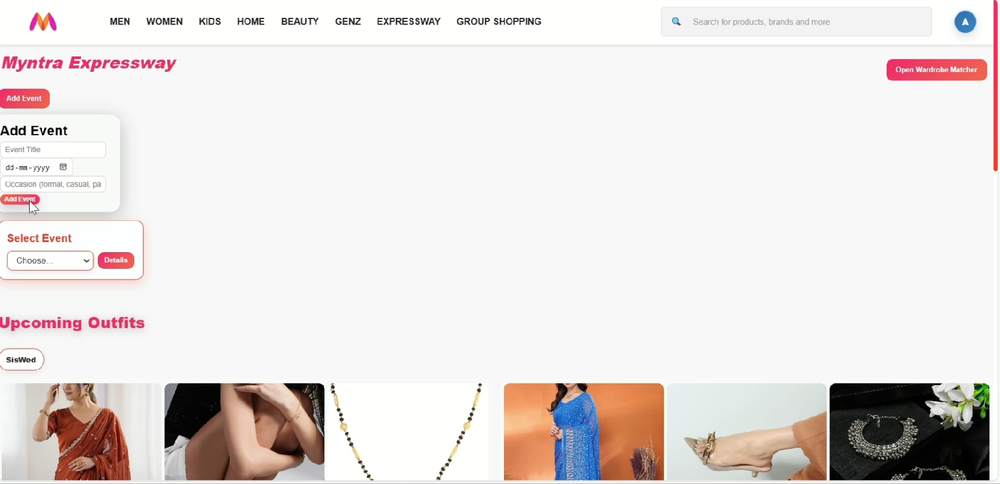
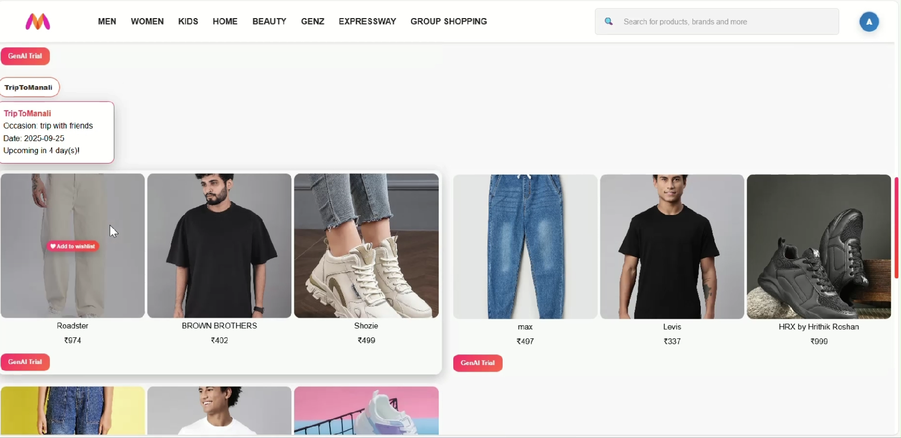
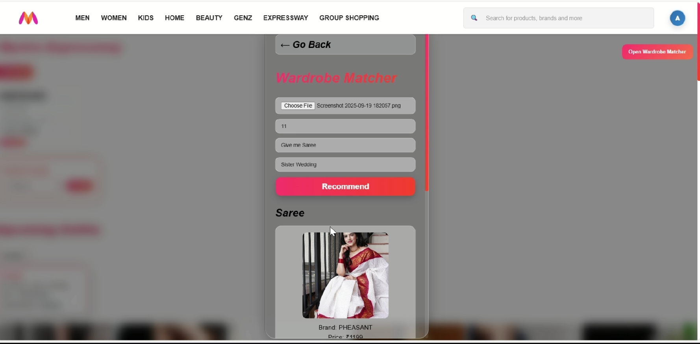
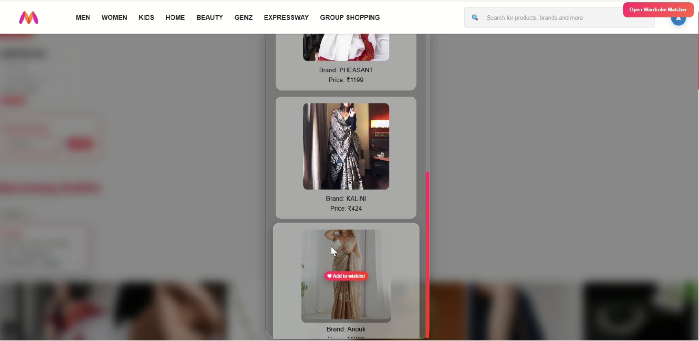
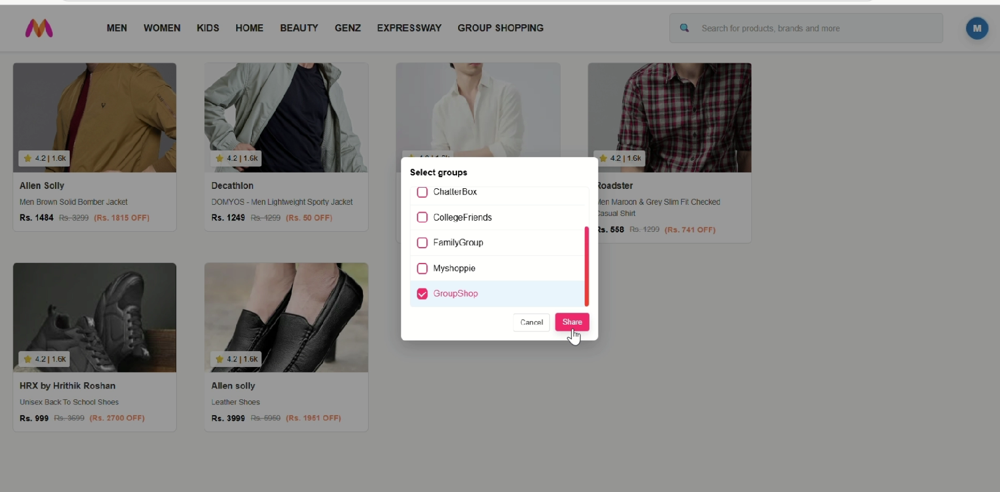
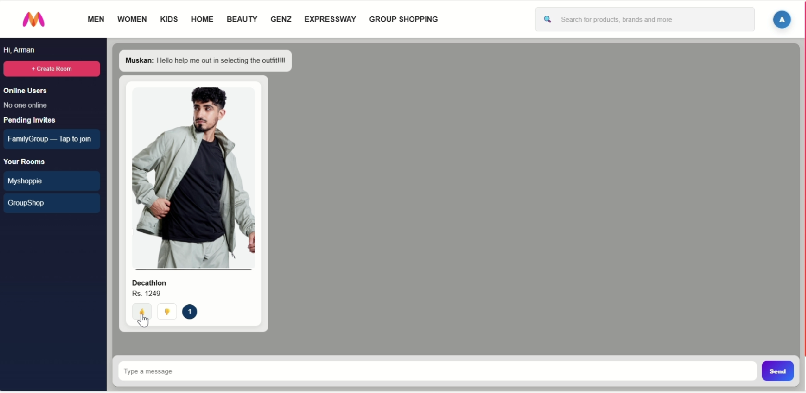

# Myntra Expressway – Smart Fashion Assistant 🚀


**Myntra Expressway** is an **AI-powered fashion planner and shopping companion** designed to make dressing up smarter, cost-effective, and socially engaging.  
It combines **event-aware outfit recommendations, wardrobe intelligence, and collaborative shopping** into one seamless experience, ensuring users are always **event-ready, stylish, and confident**.

---

## Problem Customers Face🚨: 

Customers today face multiple challenges while shopping for fashion online:

- **Last-minute rush** – Before personal events (weddings, office meetings, birthday parties, college fests), users often scramble to put together outfits.  
- **Lack of personal context** – Generic recommendations (e.g., *“Diwali offers”*) ignore specific event requirements (cousin’s engagement vs. friend’s wedding vs. mom’s birthday).  
- **Decision fatigue** – Huge online catalogs make browsing, comparing, and mixing items manually exhausting and time-consuming.  
- **Wardrobe disconnect** – Shoppers often buy new clothes without reusing existing items, increasing cost and reducing affordability.  
- **No social touch** – Online shopping lacks instant peer feedback, unlike offline shopping trips with friends and family.

## 🔥 Features

---

### 1. 🗓️ Style Scheduler  
The **Style Scheduler** acts as your **personal stylist calendar**.  
- Sync or add events (wedding, birthday, office party, interview, festival).  
- AI curates **complete outfits** tailored to the occasion.  
- Smart reminders (T-10, T-5, T-2 days) so you never miss an event look.  
- Expressway-eligible suggestions ensure delivery before the event.  
- Optional AR try-on to preview the look for future scope.  

📸 Demo 
<br></br>
  
<br><br>
 


### 2. 👕 Wardrobe Matcher  
The **Wardrobe Matcher** ensures **cost-friendly shopping** by using what you already own.  
- Upload your wardrobe (photos) and in future scope auto-sync past Myntra purchases.  
- AI suggests only **missing pieces** to complete the look.  
- Smart recommendations to reuse clothes.  
- Encourage reuse of existing wardrobe → Myntra becomes a “sustainable fashion partner.”
  
📸 Demo: 
<br></br>
  
<br><br>
 


---

### 3. 👯 Group Shopping  
The **Group Shopping** feature enables **social styling** for events.  
- Create groups with friends, colleagues, or family.  
- Getting upvoting and downvoting from peers.  
- Great for weddings, parties, team functions, or festive events.  
- Shared cart and can also add optional feature **cost-split checkout**.  
- Enhances engagement and builds community around fashion.  

📸 Demo:
<br></br>
  
<br><br>
 


---

## 🌟 Advantages

### Customer Benefits
- Proactive fashion planning with event alerts.  
- Cost-efficient → buy only missing items.  
- Confidence with AR try-on and curated looks.  
- Social engagement through group shopping.  

### Business Benefits
- Higher user engagement and retention.  
- Increased Average Order Value (AOV).  
- Seasonal trend insights via event data.  
- Competitive advantage in fashion e-commerce.  

---

## 🛠️ Tech Stack

- **Frontend**: React.js, Tailwind CSS, Figma (UI design)  
- **Backend**: Node.js,FastAPI + Uvicorn  
- **Database**: MongoDB / PostgreSQL  
- **AI Models**:  
  - [CLIP](https://huggingface.co/openai/clip-vit-base-patch32) for outfit embeddings  
  - [Sentence-Transformers](https://www.sbert.net/) for NLP-based search & event analysis  
- **Vision & Color**: PIL + NumPy + custom color matching 

---

## ⚙️ Installation / Setup

```bash
# Clone repository
git clone https://github.com/yourusername/myntra-expressway.git
cd myntra-expressway

# Install backend dependencies
cd backend
npm install

# Install frontend dependencies
cd ../frontend
npm install

# Run backend server
cd ../backend
npm start

# Run frontend
cd ../frontend
npm start

#Setup for AI Layer

cd Recommendation_Model
pip install -r requirements.txt
python extract_data.py
uvicorn app:app --reload --host 0.0.0.0 --port 8000
